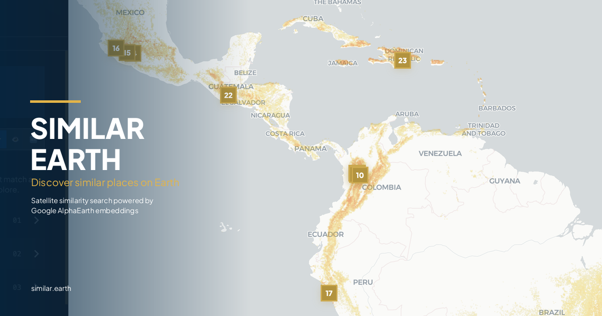

# Similar Earth

[](https://github.com/pariosur/similar-earth/actions/workflows/ci.yml)

**Discover similar places anywhere on Earth using satellite data.**

**[Live Demo: similar.earth](https://similar.earth)**



Similar Earth lets you pin locations you know and instantly see everywhere on Earth with similar satellite conditions. Drop pins on coffee farms, solar installations, mangrove forests, or anything else. The system compares satellite fingerprints against every land pixel on the planet and shows you what matches.

Built on [Google AlphaEarth](https://developers.google.com/earth-engine/datasets/catalog/GOOGLE_SATELLITE_EMBEDDING_V1_ANNUAL) satellite embeddings (2025) at 10m resolution. Open source.

## How it works

1. **Pin places you know.** Farms, beaches, forests, solar panels, anything.
2. **We scan the planet.** Your pins get compared against every land pixel on Earth using 64-dimensional satellite embeddings.
3. **See what matches.** A global heatmap shows similarity from yellow (moderate) to red (strong). Zoom in for 10m field-level detail.

A place lights up if it looks like any of your pins. The engine uses MAX similarity, so diverse reference points (highland + coastal farms, for example) both contribute.

## Featured maps

Ships with 12 pre-built maps across 4 categories:

| Category | Maps |
|----------|------|
| Agriculture | Hass Avocado, Specialty Coffee, Wine Grapes, Cacao, Macadamia, Sugarcane |
| Energy | Solar Farms |
| Natural Ecosystems | Mangroves, Tropical Dry Forest, Glaciers, Tropical Coastline |
| Climate Risk | Wildfire Zones |

Each map uses verified reference coordinates. Featured maps have pre-rendered tiles for instant loading.

## Quick start

### Prerequisites

- [Go](https://go.dev/) 1.22+
- [Node.js](https://nodejs.org/) 20+
- [Python](https://python.org/) 3.11+
- [Docker](https://docker.com/) (for PostgreSQL)
- [Google Earth Engine](https://earthengine.google.com/) account (for data pipeline and 10m refinement)

### 1. Clone and install

```bash
git clone https://github.com/pariosur/similar-earth.git
cd similar-earth
cp .env.example .env

# Frontend
cd frontend && npm install && cd ..

# Python
cd python && pip install -r requirements.txt && cd ..
```

### 2. Generate the embedding grid

Requires a Google Earth Engine account.

```bash
# Export AlphaEarth embeddings from Earth Engine (runs 2-4 hours on GEE servers)
python scripts/export_global_embeddings.py

# Download the GeoTIFF tiles from Google Drive, then convert:
python scripts/build_grid_bin.py ~/Downloads/alphaearth_embeddings_2km_2025*.tif
```

Creates `data/grid.bin` (~8.5 GB): 64-dimensional int8 embeddings for every 2km land pixel on Earth.

### 3. Precompute featured maps

```bash
# Compute similarity scores for all featured maps
python scripts/precompute_layers.py

# Pre-render PNG tiles for instant loading
python scripts/prerender_tiles.py --max-zoom 8
```

### 4. Run

```bash
make dev
```

Starts PostgreSQL (Docker), Go API server, Python GEE service, and Vite frontend. Open http://localhost:3000.

## Architecture

```
Frontend (React + MapLibre GL)
    |
Go API Server (Fiber)
    |-- Pre-rendered tiles (static PNGs, zoom 2-8)
    |-- Similarity engine (int8 dot product, parallel)
    |-- Grid loader (8.5 GB in-memory)
    |-- COG fetcher (10m on-demand via Earth Engine)
    |
Python GEE Service (FastAPI)
    |-- Earth Engine computePixels (10m refinement)
    |-- Terrain, landcover, biophysical data
    |
PostgreSQL
    |-- Maps, queries, event logs
```

### Data pipeline

```
Earth Engine (AlphaEarth V1 Annual)
  -> export_global_embeddings.py -> 64-band GeoTIFF (2km)
  -> build_grid_bin.py -> grid.bin (8.5 GB, int8)
  -> precompute_layers.py -> scores_*.bin (665 MB per map)
  -> prerender_tiles.py -> tiles/{slug}/{z}/{x}/{y}.png
```

### Resolution: 2km vs 10m

The app operates at two resolution levels:

- **2km (Global scan):** Pre-computed. Every land pixel on Earth is compared against your reference pins using the 8.5 GB in-memory embedding grid. Results are instant because the similarity scores are already calculated. This is what you see at zoom levels 2-9.
- **10m (Detail scan):** On-demand. When you zoom past level 10 and click "10M", the app fetches 10-meter AlphaEarth embeddings from Google Earth Engine in real time. Each 256x256 tile takes ~3 seconds on first load. This reveals field-level patterns invisible at 2km.

### Tile caching

HD tiles are expensive (each one calls Earth Engine), so they're cached aggressively:

1. **In-memory cache:** up to 10,000 tiles in an LRU cache. Instant on repeat views.
2. **Disk cache:** HD tiles are saved to `tiles/{slug}/{z}/{x}/{y}.png` on first compute. Survives server restarts.
3. **Pre-rendered tiles:** Featured maps have tiles pre-rendered at zoom 2-8 via `scripts/prerender_tiles.py`. Served as static PNGs by nginx, no computation needed.

First-time HD views take ~3s per tile, but everything after that is instant.

## Adding a new map

1. Add reference coordinates to `data/layer_references.json`:

```json
{
  "my-map": {
    "name": "My Map",
    "category": "Conservation",
    "featured": true,
    "pins": [
      {"lat": 12.34, "lng": 56.78, "label": "Location Name, Country"}
    ]
  }
}
```

2. Precompute and render:

```bash
python scripts/precompute_layers.py --layer my-map
python scripts/prerender_tiles.py --layer my-map
```

3. Restart the server. New map appears in the gallery.

## Contributing

Contributions welcome, especially:

- Verified reference coordinates for new maps
- Bug fixes and performance improvements
- New categories and use cases

When adding coordinates, verify each one in Google Maps satellite view. Quality over quantity.

## Tech stack

- **Backend:** Go (Fiber), PostgreSQL
- **Frontend:** React, TypeScript, Vite, Tailwind CSS, MapLibre GL JS
- **Data:** Google AlphaEarth embeddings, Earth Engine, ESA WorldCover
- **Basemap:** CARTO Dark Matter (free, no API key)

## Attribution

The AlphaEarth Foundations Satellite Embedding dataset is produced by Google and Google DeepMind, licensed under [CC-BY 4.0](https://creativecommons.org/licenses/by/4.0/).

## License

MIT. See [LICENSE](LICENSE).
